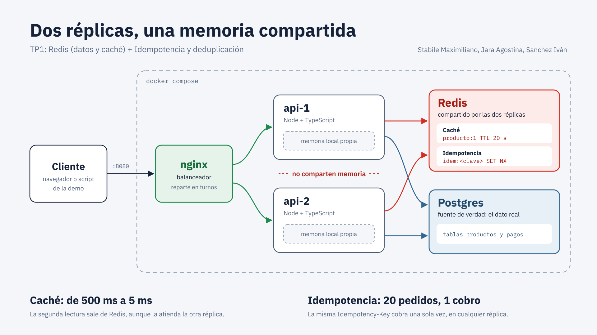

# TP1 – Redis (datos y caché) + Idempotencia y deduplicación

**Integrantes:** Stabile Maximiliano, Jara Agostina, Sanchez Iván



## Panel de demo

Un panel web muestra en vivo la caché, la idempotencia, la deduplicación y las fallas.

```bash
docker compose up --build -d
```

Después abrir **http://localhost:8080** en el navegador. El panel usa solo HTML/CSS/JS
(sin internet) y habla con la API bajo el prefijo `/api/`.

## Documentación

| Archivo | Contenido |
|---|---|
| [`docs/INFORME.md`](docs/INFORME.md) | Conceptos, decisiones, problemas encontrados, resultados y posibles preguntas |
| [`docs/GUION.md`](docs/GUION.md) | Guion del coloquio minuto a minuto |
| [`evidencias/`](evidencias/) | Capturas y salidas reales de la demo |

## Arquitectura

```
cliente → nginx (:8080) → api-1 / api-2 (Node + TypeScript) → Redis + Postgres
                                          worker → Redis (stream) + Postgres (emails)
```

| Servicio | Rol |
|---|---|
| `nginx` | Sirve el panel en `/` y balancea la API (round-robin) en `/api/`; único puerto expuesto (8080) |
| `api-1`, `api-2` | Dos réplicas de la misma API; header `X-Instance` indica cuál respondió |
| `redis` | Caché, claves de idempotencia y cola de eventos (con AOF activado) |
| `postgres` | Fuente de verdad (productos, pagos y emails) |
| `worker` | Consume la cola `pagos:eventos` y "envía los emails", deduplicando los reenvíos |

## Requisitos

- Docker y Docker Compose
- Node.js 18 o superior (solo para correr los scripts de `demo/`)

## Cómo levantar

```bash
docker compose up --build -d
docker compose ps          # todos los servicios deben estar "running" / "healthy"
node demo/00_health.mjs    # verifica balanceo y conexión a Redis/Postgres
```

## Endpoints

Desde el navegador o los scripts, las rutas van con el prefijo `/api` (p. ej. `http://localhost:8080/api/productos/1`).

| Método | Ruta | Descripción |
|---|---|---|
| GET | `/api/health` | Estado de la réplica y conexiones |
| GET | `/api/productos/:id` | Lee un producto (cache-aside). Header `X-Cache: HIT/MISS` |
| PUT | `/api/productos/:id` | Actualiza `precio`/`stock` e invalida la caché |
| POST | `/api/pagos?modo=off\|memoria\|redis` | Crea un pago. Header `Idempotency-Key` (obligatorio salvo en `off`). Body `{"cliente": "ana", "monto": 15000}`. Al cobrar devuelve `eventoId` |
| GET | `/api/pagos?cliente=ana` | Cuántos cobros quedaron registrados para ese cliente |
| GET | `/api/emails?cliente=ana` | Comprobantes "enviados" por el worker a ese cliente |
| GET | `/api/admin/estado` | Salud de Redis, Postgres y worker (responde 200 aunque Redis esté caído) |
| GET | `/api/admin/redis` | Claves guardadas en Redis en este momento (vía `SCAN`) |
| GET/POST | `/api/admin/dedup` | Lee o cambia el interruptor de deduplicación (`on`/`off`) |
| POST | `/api/admin/reenviar` | Simula que la cola reentrega un evento (`{ eventoId }`) |
| GET | `/api/admin/worker-log` | Últimos resultados del worker (enviado / duplicado descartado) |
| POST | `/api/admin/reset` | Deja la demo como al principio |

> Los scripts usan `docker compose exec redis redis-cli`. Si Redis corre de otra forma, se puede cambiar con la variable `REDIS_CLI`.

## Comandos útiles

```bash
docker compose logs -f api-1 api-2                      # ver logs de las réplicas
docker compose logs -f worker                           # ver envíos de emails y duplicados descartados
docker compose exec redis redis-cli                     # consola de Redis
docker compose exec postgres psql -U tp1 -d tienda      # consola de Postgres
docker compose down -v                                  # apagar y BORRAR datos (reinicia la BD)
```

> **Al pasar de la Fase 2 a la 3** hay que ejecutar `docker compose down -v` y después `docker compose up --build -d`, porque se agregó la tabla `pagos`.
>
> Si se modifica `db/init.sql`, hay que ejecutar `docker compose down -v` para que Postgres lo vuelva a aplicar.

## Escenarios de la demo

| Script | Qué demuestra |
|---|---|
| `demo/00_health.mjs` | Infraestructura y balanceo entre réplicas |
| `demo/01_cache.mjs` | Caché: MISS vs HIT, caché compartida entre réplicas, TTL e invalidación (`--ttl` para ver el vencimiento) |
| `demo/02_idempotencia.mjs` | Un cliente reintenta el mismo pago 3 veces: sin protección (3 cobros), memoria local (2 cobros) y Redis (1 cobro) |
| `demo/03_concurrencia.mjs` | 20 peticiones simultáneas con la misma clave: memoria local (2 cobros) vs Redis (1 cobro) |
| `demo/04_redis_caido.mjs` | Apaga Redis: la caché sigue funcionando (fail-open), los pagos se rechazan (fail-closed) y al volver la clave sigue ahí (AOF) |
| `demo/05_dedup.mjs` | Deduplicación: con el interruptor en `off` un reenvío genera 2 emails; en `on`, 1 email y el worker descarta el duplicado |
